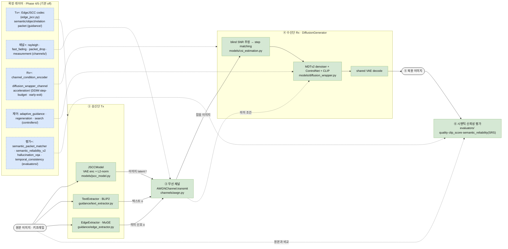

# 개발계획서 (업데이트판)
## 생성 AI 기반 시맨틱 미디어 전송 신뢰성 평가·고도화 프레임워크

> 보관본. 최신 요약은 [etri_strategy.md](../etri_strategy.md)를 우선 참조.

> 초기 개발계획서를 현재 구현 상태에 맞춰 최신화한 문서다. **논문 정합 영역 ↔ ETRI
> 확장 영역**, **구현 완료 ↔ 부분/스캐폴드 ↔ 미구현**을 구분해, 계획이 아닌 현재
> 구현 상태를 명시한다.

---

## 한 페이지 요약 (TL;DR)

**무엇** — SGD-JSCC 추론 코어(paper-faithful, forward 수치 불변)를 보존한 채, 원본이
비운 평가·제어·채널·영상·학습 골격을 얹은 ETRI용 **시맨틱 미디어 전송 신뢰성 플랫폼**.

**목표** — 픽셀 복원(PSNR)이 아니라, 노이즈 채널 통과 후 **송신 의도 보존도**와
**할루시네이션**을 정량화한다.

**핵심 축 5가지**
- **평가 3계층** — SRS → srs_packet → srs_v2(+VQA·시간축)
- **채널 확장** — AWGN → Rayleigh/fast-fading/packet-drop + 채널 조건화
- **복원 제어** — SNR 적응 guidance + 실패유형 regeneration + 다중전략 search
- **저지연** — DDIM step-budget · early-exit · consistency 인터페이스
- **학습 재현** — 논문 3-stage + 보조 stage(edge codec, CSI 추정) scaffold

**충실도 구분** — 추론=paper-faithful / 학습·채널·평가=paper-like·scaffold·ETRI 확장.
확장 기능은 **기본 off**, 마스터 스위치를 끄면 원본 추론과 수치적으로 동일.

**현황** — Phase 1~4 완료, Phase 5 부분/스캐폴드. 상세는 §3(한계 매핑)·§8(구현 현황)·
§12(변경표) 및 [phase4.md](../phase4.md) / [phase5.md](../phase5.md).

> 이 아래는 상세 기록(부록 성격)이다. 빠른 파악은 위 요약으로 충분하다.

---

## 용어 정리

**충실도 4단 분류** — 각 기능이 논문/원본에 얼마나 충실한지를 다음으로 표기한다.

| 분류 | 의미 |
|---|---|
| **paper-faithful** | 원본/논문 알고리즘을 수치까지 동일하게 재사용·재현 |
| **paper-like** | 구조·목적은 동일하나 정확 수치(데이터·하이퍼파라미터·손실 가중)는 근사 |
| **scaffold** | 실행·테스트 가능한 뼈대만, 학습된 모델·정밀 수치는 미완 |
| **ETRI 확장** | 논문에 없으나 과제 목표를 위해 새로 추가 |

상태 아이콘: ✅ 구현·연결 / 🟡 부분·스캐폴드 / 🔲 미구현. "세션 외" = 네트워크·사전학습
가중치가 있어야 수치 산출 가능.

**핵심 용어** — SGD-JSCC(의미 가이드로 확산 모델을 채널 잡음 복원기로 쓰는 전송 기법),
JSCC(소스+채널 부호화를 신경망으로 통합), CSI(채널 상태 정보, 모르면 "블라인드"),
step matching(채널 잡음을 확산 복원 시작 시점에 대응), water-filling(원소별 잡음에 맞춰
디노이징 배분), semantic packet(이미지를 객체·관계·속성·장면으로 분해한 "의미 명세서"),
SRS/srs_packet/srs_v2(의미 보존도 종합 → 의미 단위 분해 → 시간축·VQA 통합),
regeneration(채널 재전송 없이 수신단에서 재복원), adaptive guidance(SNR에 맞춰 가이드
강도·스텝 조절).

---

## 0. 초기 계획 대비 주요 변경점

초기 계획은 "SGD-JSCC로 AWGN에서 semantic fidelity와 hallucination을 평가하는 단일
이미지 프로토타입"이었다. 현재는 이를 유지하며 다음으로 확장했다.

- **평가 세분화**: 단일 SRS → 의미 단위(srs_packet) → VQA·시간축 통합(srs_v2) 3계층.
- **단일 이미지 → 영상/시간축**: 키프레임·시맨틱 델타·시간적 일관성 지표.
- **AWGN → 다중 채널 + 채널 조건화**: Rayleigh/fast-fading/packet-drop + 수신 evidence 활용.
- **고정 복원 → 적응·재생성·저지연**: SNR 적응 가이드, 실패유형 regeneration, 다중 전략
  search, DDIM step-budget·early-exit.
- **추론 전용 → 학습 재현 scaffold**: 논문 3-stage + 보조 stage(edge codec, CSI 추정),
  부분 충실(구조적 근사).
- **마스터 스위치**: 확장 기능은 기본 off, 상위 게이트로 일괄 제어 — 끄면 원본 추론과
  수치적으로 동일(베이스라인 재현성).

핵심은 **원본 `SGDJSCC/`의 논문 정합 추론 코어는 보존**하면서, 원본이 비워둔 평가·제어·
채널·영상·학습 골격을 메운 것이다. 상세 변경표는 [12장](#12-초기-계획-대비-변경확장-요약표).

---

## 1. 개발 목표

SGD-JSCC의 단순 재현이 아니라 ETRI용 **시맨틱 미디어 전송 신뢰성 향상·평가 플랫폼**으로
고도화한다: 베이스라인 재현성을 고정한 채, 노이즈 채널 통과 후 **송신 의도 보존도**와
**할루시네이션**을 정량화하고, guidance(text/edge/depth/seg/패킷)·채널·영상·저지연으로
단계 확장한다. 성공 기준은 PSNR이 아니라 **의미 전달 신뢰성**이다. 목표·파이프라인 서술은
[etri_overview.md](../etri_overview.md) 참조.

## 2. 기본 모델 선정

**백본: SGD-JSCC로 고정.** 송신단에서 semantic guidance(텍스트·엣지)를 명시 추출·전송하고
확산 모델을 채널 오염 latent의 **복원기(denoiser)**로 쓰는 구조가 "의도 일치도·할루시네이션
완화"라는 ETRI 목표에 직접 부합한다. 채널 적응을 확산에 위임하고 JSCC 코어는 고정할 수
있어 채널·가이드·평가를 모듈로 분리하기 유리하다. DiffJSCC(후처리형, realism/downstream
seg 강조) 대비 semantic-guided denoising 구조가 "의미 왜곡 억제"에 더 적합하다.

**알고리즘 보존 불변식**: 추론 순전파 수치(VAE 스케일링, AWGN 공식, blind SNR, step
matching, canny 재전송, 최종 decode)는 변경하지 않고, 모든 신규 기능은 opt-in 확장으로 얹는다.

### 2.1 모델 구조 (블록다이어그램)

`src/sgdjscc_lab/`의 실제 모듈 흐름. **실선 = 논문 정합 core 경로(paper-faithful)**,
**점선 = Phase 4/5 확장 레이어(기본 off)**. 채널로 보내는 것은 이미지 latent `f` +
의미 신호 `o`(엣지·텍스트)이며, 수신단 확산 모델이 잡음을 벗겨내며 의미를 복원한다.

`runtime.build_models()`가 위 core 구성요소를 `ModelBundle`(jscc_model · sem_pipeline ·
text_extractor · edge_extractor)로 묶고, `pipelines/infer_pipeline.py`가 128×128 패치
단위로 forward를 조율한다. 파일별 실행 흐름 상세는
[framework_file_roles.md](./framework_file_roles.md) 참조.

---

## 3. 핵심 한계점 ↔ 해결 모듈 매핑

| # | 핵심 한계 | 해결 모듈·블록 | 상태 |
|---|---|---|---|
| H1 | 화질은 자연스럽지만 없던 객체·정보가 생성될 수 있고, 이를 측정할 지표가 없음 | semantic packet, packet-aware verifier, hallucination evaluator, VQA hallucination evaluator, regeneration, SRS/srs_packet/srs_v2 | 구현/부분 |
| H2 | 평가가 `PSNR`·`SSIM` 같은 화질 중심이고 의미 보존 지표가 부족함 | evaluator suite, CLIP image-image/text-image, object preservation/missing/additional, semantic reliability score 체계, FID(fail-fast) | 구현 |
| H3 | 정지 이미지 중심이고 영상의 시간 흐름과 장면 전환을 다루지 못함 | temporal keyframe pipeline, scene change 처리, semantic delta, temporal consistency evaluator(temporal_srs 등) | 구현/부분 |

**핵심 우선순위**: H1(할루시네이션 완화·검출) → H2(의미 충실도·신뢰성 평가 체계) →
H3(시간축 확장). H1이 ETRI 목표에 가장 직접 반하고, H2는 H1을 입증하는 평가 기반이며,
H3는 정지 이미지 실험을 영상 시나리오로 확장하는 축이다.

**보조 연구 축**: 가이드 손상·오버헤드, 저지연 복원, 블라인드/페이딩 채널 견고성,
MIMO/OFDM/다중사용자 확장은 핵심 3축 위에서 다루는 후속 트랙으로 둔다.

---

## 4. 송수신단 고도화 방향

**송신단(Tx)**
- **guidance 추출 확장** — text(거친 의미)·edge(구조 윤곽)·segmentation(영역/클래스)·
  depth(기하)를 동일 인터페이스로 추가, 채널 예산·콘텐츠에 맞게 조합.
- **semantic packet 계층** — 의미 명세서를 Tx에서 구성(현재 평가·제어 메타데이터, 실제
  패킷 코딩은 향후). 중요도 기반 전송 순서·재사용 정책의 기반.
- **semantic delta** — 키프레임은 전체 패킷, 인터프레임은 변경분만 → 시맨틱 오버헤드 절감.
- **edge codec** — 엣지를 이미지 VAE에 섞지 않고 전용 인코더→채널→projector 링크로 전송
  (BCE+Dice 학습). 부가정보를 독립 채널 자원으로 분리 분석.

**수신단(Rx)**
- **measurement bundle** — received/equalized latent·gain·noise·mask·SNR·reliability를
  operator 형태로 추상화 → channel condition encoder가 조건 토큰으로 압축. 단 현재 조건
  토큰을 frozen denoiser가 직접 소비하진 않고(재학습 필요), received-latent 초기화 +
  reliability 기반 guidance/step 스케일로 작동.
- **channel-conditioned reconstruction** — latent/joint/blind 모드, one-pass(패치별
  측정→이미지 레벨 집계→동일 latent 재사용 디코딩). Rayleigh/fast-fading/packet-drop,
  미지/불완전 CSI 대응.
- **regeneration loop/search** — 신뢰도(SRS/SRS-v2) 낮으면 채널 재전송 없이 가이드 조합을
  바꿔 재복원(단발 → 다중 전략, 검증 점수 최댓값 선택).
- **temporal keyframe reuse** — 인터프레임은 키프레임 재사용 + 델타(중복 제거 + 시간적 일관성).
- **low-latency sampling** — DDIM step-budget·dynamic routing·early-exit로 스텝 단축,
  향후 consistency student 인터페이스.

---

## 5. 사용 데이터셋

**학습 축**

| 데이터셋 | 형태 | 용도 |
|---|---|---|
| ImageNet | image-only | Stage 1 JSCC / CSI 추정 / edge codec |
| COCO2017 | text-image | Stage 2 text-DM / Stage 3 ControlNet (단일/멀티캡션) |
| JourneyDB subset | text-image | Stage 2/3 보조 |
| CelebA | image-only | 도메인 특화(text stage 시 캡션 자동 생성, paper-like) |

**평가 축** — COCO val2017 / Kodak / ADE20K, 입력은 128×128 패치 타일링(H·W 128 배수).
데이터셋 역할·stage 매핑·변환 상세는 [dataset_status.md](./dataset_status.md).

**규모·지표 한계(정직 공개)**: 논문 ~1,400만 pair·250k-step 스케줄은 미포함(로컬은 소규모
subset). CLIP text-image는 캡션 공급 시 동작하는 확장 지표, 정식 mIoU는
segmentation-consistency로 대체.

---

## 6. 평가 지표

지표 정의·SRS 가중치는 [etri_overview.md](../etri_overview.md)와 겹친다 — 여기서는 계층·
기록 규칙만 요약한다.

- **품질/의미** — PSNR/SSIM/LPIPS(SSIM은 논문 외), CLIP image-image, CLIP text-image
  (캡션 공급 시 확장), object preservation/missing/additional·hallucination_score.
- **SRS 3계층** — SRS = 0.30 clip_ii + 0.25 clip_ti + 0.25 preservation − 0.10 missing
  − 0.10 additional → **srs_packet**(의미 단위 검증) → **srs_v2**(base+packet+temporal+VQA).
- **temporal** — temporal_srs, srs_flicker, object_identity_consistency,
  temporal_segmentation_iou, temporal_hallucination_rate, overhead_reduction.
- **FID** — 분포 수준 품질(논문 §VI), proxy/미가용 시 fail-fast.

**기록 규칙**: 표준 경로는 psnr/ssim/lpips/clip_ii/object rates/hallucination/SRS/fid
(clip_ti·srs_v2는 각각 캡션·별도 플래그가 있어야 산출).

**연구개발 요소 ↔ 검증 지표**

| 요소 | 1차 지표 | 보조 |
|---|---|---|
| hallucination 완화(VQA, regeneration) | hallucination_score, additional_object_rate | srs_v2, srs_packet |
| packet verifier | srs_packet, object_match_rate | relation/attribute/segmentation consistency, error count |
| adaptive guidance | SNR sweep SRS/srs_packet 개선 | guidance regime 로깅 |
| regeneration search | SRS/srs_v2 최댓값 | 선택 전략 로깅 |
| temporal pipeline | temporal_srs, overhead_reduction | srs_flicker, identity/seg IoU, temporal_hallucination |
| channel-conditioned recon | SNR sweep SRS/FID/CLIP 개선 | reliability 기반 로깅 |
| low-latency sampling | 지연 대비 SRS/LPIPS 유지 | 50-step 대비 speedup |
| edge codec | edge-link BCE/Dice/IoU/F1 | 다운스트림 srs_packet |

---

## 7. 통합 관점 (핵심 한계 → 구조 → 지표)

- **H1 할루시네이션 완화·검출**: semantic packet·verifier·VQA·regeneration →
  hallucination_score, additional_object_rate, missing_object_rate, srs_packet/srs_v2.
- **H2 의미 충실도·신뢰성 평가**: evaluator suite·SRS 통합·객체 보존/누락/추가율 →
  clip_ii, clip_ti, preservation/missing/additional, SRS 계열.
- **H3 시간축 확장**: temporal pipeline·scene change·keyframe reuse·temporal evaluator →
  temporal_srs, srs_flicker, temporal_hallucination_rate, overhead_reduction.
- **보조 축**: adaptive guidance·guide damage·edge codec·channel conditioning·early-exit는
  위 3축을 보완하는 실험 경로로 유지한다.

---

## 8. 구현 현황 및 원본 대비 보완

원본 `SGDJSCC/`는 추론 순전파는 충실하나 반복 평가·비교·기능 확장·학습 재현 골격이 거의
없다. 본 과제는 그 forward 경로를 **수치 변경 없이 재사용**(paper-faithful)하고, 모듈화·
End-to-End 평가·CSV·SRS·할루시네이션/객체 평가·packet verifier·영상/시간축·다중 채널·
채널 조건화·저지연·stage-aware 학습 scaffold로 골격을 메웠다. 논문 대비 항목별 정합표는
[paper_alignment.md](../paper_alignment.md) 참조.

### 8.1 기능군별 현황 (요약)

상태: ✅ 구현·연결 / 🟡 부분·스캐폴드 / 🔲 미구현.

| 기능군 | 상태 | 비고 |
|---|---|---|
| 원본 추론 경로 보존 | ✅ | paper-faithful (VAE 스케일링·step matching·canny 재전송) |
| 모듈화 구조 | ✅ | 채널/가이드/모델/파이프라인/평가/제어/가속/영상/학습 분리 |
| 평가 파이프라인 + CSV | ✅ | 단일 SNR + SNR sweep |
| 품질/CLIP 지표 | ✅ | PSNR/SSIM/LPIPS, CLIP image-image (text-image는 캡션 공급 시) |
| 객체 보존/할루시네이션 | ✅ | CLIP/캡션 휴리스틱 |
| SRS / FID | ✅ | 대표 지표 / 실제 Inception 백본은 세션 외 |
| guidance 확장(depth/seg) | ✅ | 최초 사용 시 외부 모델 다운로드 |
| semantic packet | 🟡 | 캡션+CLIP 휴리스틱, 메타데이터 직렬화 |
| packet-aware verifier | ✅ | 의미 단위 오류 카운트 |
| adaptive guidance / regeneration | ✅ | SNR 구간별, 실패유형 재시도 |
| 비디오/시간축 파이프라인 | 🟡 | 인터프레임=키프레임 복사, 단계적 prompt는 prompt 레벨 |
| 채널(Rayleigh/fast-fading/packet-drop) | ✅ | AWGN 호환 전송 + 풍부한 관측 |
| 가이드 전용 손상 모델 | 🟡 | 설계 방향(seg region-dropout·학습 CFG label-dropout 일부만) |
| 채널 조건화 추론 | 🟡 | 조건 토큰을 frozen denoiser가 직접 소비하진 않음 |
| water-filling(Alg.4) | 🟡 | 알고리즘·배선 완료, 실제 DM 수치는 GPU/체크포인트 의존 |
| CSI 추정 | 🟡 | SNR 추정망 학습·연결됨; phase/joint(Alg.3)은 scaffold |
| 저지연(step-budget/early-exit) | 🟡 | 연결됨, distilled student는 placeholder |
| VQA / SRS-v2 / regeneration search | ✅ | VQA 백본 가중치 미번들(없으면 CLIP fallback) |
| 학습 scaffold (3-stage) | 🟡 | 구조 재현(부분 충실), 대규모 데이터·정확 수치 미보장 |
| edge codec 학습 | 🟡 | conv 기본/ViT 옵션, WITT-exact 아님 |
| 마스터 스위치 | ✅ | 확장 일괄 on/off, 베이스라인 동등성 |

### 8.2 미구현 / 추가 검증 필요 (정직 공개)

- 채널 조건 토큰을 소비하는 조건 인식(재학습) denoiser (FiLM/cross-attention/posterior guidance).
- 학습된 consistency/distilled student 디코더(현재 few-step 근사).
- 실제 확산 체크포인트 기반 water-filling 수치, phase/joint CSI(Alg.3), 실제 Inception-FID·
  patch-GAN/LPIPS 수치·~14M pair 재현 — 데이터·컴퓨트·네트워크 의존.
- semantic packet의 실제 채널 코딩/드롭(현재 메타데이터 수준).
- 가이드 전용 통합 손상 프레임워크(설계 방향, 일부만).
- 표준 CLI의 text alignment 기본 미산출(캡션 공급 시 확장), 정식 mIoU(seg-consistency로 대체).

> 검증: 단위·통합·synthetic 테스트 통과. 실제 체크포인트 수치·DM water-filling·Inception-FID는
> 구현 경로 기준으로만 검증(수치 재현 별도).

---

## 9. 개발 단계 (Phase)

Phase 1~3(베이스라인 재현 → 모듈화 → 시맨틱 우선 평가) 완료, Phase 4(신뢰도 세분화 +
영상) 대부분 완료, Phase 5(채널 연구·저지연·강한 검증) 부분/스캐폴드. 병행 트랙으로 학습
재현 scaffold(부분 충실)와 DeepJSCC/DiffJSCC/SGD-JSCC/Proposed 비교·ablation.

- 단계별 상세: [phases_1to3.md](./phases_1to3.md) · [../phase4.md](../phase4.md) · [../phase5.md](../phase5.md)
- 한계점 개선 매핑: [etri_development_roadmap.md](./etri_development_roadmap.md)

## 10. 실험 시나리오

- **채널**: AWGN 기본 + Rayleigh/fast-fading/packet-drop.
- **SNR sweep**: 기본 [-5,0,5,10] dB, 확장 [-5,0,5,10,15,20,25] dB.
- **입력**: 128×128 패치 + 고해상도 merge.
- **가이드 손상 규칙(설계 방향)**: AWGN/Rayleigh는 JSCC latent/채널 심볼에만, 가이드는
  edge=dropout/blur/erasing, seg=영역 제거, 캡션=token dropout으로 손상. 현재 일부만 구현.
- **대표 ablation**: ① baseline → ② +adaptive guidance → ③ +packet verifier → ④ 키프레임
  full packet → ⑤ 키프레임+델타 → ⑥ 채널 조건화(블라인드 유무) → ⑦ few-step 저지연.
- **평가 순서**: COCO val2017 → Kodak → ADE20K → CelebA.

## 11. 기대 산출물 및 최종 방침

- **산출물**: 모듈형 연구 패키지(마스터 스위치로 베이스라인 동등성), 재현 가능한 추론/
  평가/학습 설정, 3계층 신뢰성 체계(SRS/srs_packet/srs_v2)+시간축 지표+FID, 할루시네이션
  완화·채널 적응·저지연·영상 효율 모듈, 학습 scaffold, 비교·ablation 결과.
- **포지셔닝**: "새 전송 알고리즘"이 아니라, 변경되지 않은 SGD-JSCC 복원 경로 위에 얹은
  **신뢰성 측정·제어 + 영상/채널 확장 레이어**. 기여는 "유사도 지표가 못 잡는 의미 붕괴/
  할루시네이션의 분해·정량화 및 채널·시간축 확장".

---

## 12. 초기 계획 대비 변경/확장 요약표

| 항목 | 초기 계획 | 현재 |
|---|---|---|
| 평가 지표 | PSNR/SSIM/LPIPS/FID/CLIP/mIoU + object preservation 등 | SRS→srs_packet→srs_v2 3계층 + 시간축 지표 + FID(fail-fast) |
| 할루시네이션 | hallucinated object count(휴리스틱) | CLIP 휴리스틱 + VQA + packet 카운트(누락/추가/관계/속성) |
| 복원 제어 | 고정 복원 | SNR 적응 가이드 + 실패유형 regeneration + 다중전략 search |
| 채널 | AWGN 단일 | + Rayleigh/fast-fading/packet-drop + 채널 조건화 + water-filling |
| 복원 속도 | 미고려 | DDIM step-budget + dynamic routing + early-exit + consistency 인터페이스 |
| 매체 범위 | 단일 이미지(128×128) | + 영상 키프레임/델타/temporal 지표 |
| 부가정보 | text + edge | + depth/segmentation + semantic packet/delta + edge codec |
| 학습 | 추론 전용 구상 | 논문 3-stage + edge codec/CSI 학습 scaffold(부분 충실) |
| 데이터셋 | COCO/Kodak/ADE20K/CelebA-HQ, mIoU 중심 | 학습축(ImageNet/COCO/JourneyDB/CelebA) + 평가축(COCO/Kodak/ADE20K); mIoU→seg-consistency |
| 확장 제어 | 없음 | 마스터 스위치로 일괄 on/off, 베이스라인 동등성 |
| 충실도 구분 | 미구분 | 추론=paper-faithful / 학습·채널·평가=paper-like·scaffold·확장 |

## 참고 링크
- SGD-JSCC: https://arxiv.org/abs/2501.01138 · DiffJSCC: https://arxiv.org/abs/2404.17736 · DeepJSCC: https://arxiv.org/abs/1809.01733
</content>
