# 프레임워크 비교

## 목적

이 문서는 다음을 비교한다:

- 원본 `SGDJSCC/` end-to-end 추론 프레임워크
- `sgdjscc_lab/` **Phase 2** 모듈화 프레임워크

목표는, 동일한 AWGN 시맨틱 이미지 전송 파이프라인을 알고리즘적으로는 유사하게
유지하면서 연구·확장을 위해 구조적으로 어떻게 재구성했는지 보여주는 것이다.

> 문서 하단의 [논문 정합 비교](#논문-정합-비교-paper--sgdjscc_lab)는 **SGD-JSCC
> 논문**과 `sgdjscc_lab` 구현이 **어디까지 일치/상이한지**를 paper-faithful /
> paper-like / scaffold / 미구현으로 구분해 정리한다.

---

## 나란히 본 블록 다이어그램

```mermaid
flowchart LR
    subgraph ORIG["Original SGDJSCC  (monolithic)"]
        direction TB
        O1["inference_one.py\nEntry Script"]
        O2["inference_config.py\nhardcoded paths + flags"]
        O3["Inline Model Construction\nJSCC / BLIP2 / MuGE\nDiffusion / ControlNet / CLIP"]
        O4["Input Image / Dataset\nImageFolder or direct image"]
        O5["Patch Preparation\nsplit_image_v2() inline"]
        O6["Semantic Guidance\nBLIP2 caption + MuGE soft edge"]
        O7["JSCC Encode\nVAE encode · scale 15.45 · L2 norm"]
        O8["Wireless Channel\ninline AWGN injection"]
        O9["Step Matching\nblind SNR · power scalar · mask token"]
        O10["Canny Re-Transmission\ncanny TX net · canny latent"]
        O11["Diffusion Denoising\nMDTv2 / ControlNet"]
        O12["Final Decode\nVAE decode · save · evaluate inline"]
        O1 --> O2 --> O3 --> O4 --> O5 --> O6
        O6 --> O7 --> O8 --> O9 --> O10 --> O11 --> O12
    end

    subgraph LAB["sgdjscc_lab Phase 2  (modular)"]
        direction TB
        L1["scripts/infer_images.py\nCLI Entry"]
        L2["config.py + default.yaml\nCLI override merge"]
        L3["runtime.py shim\nModelBundle assembly"]
        L4["models/\njscc_model · diffusion_wrapper · model_bundle"]
        L5["io.py\nsingle image or folder"]
        L6["utils/preprocessing.py\nprepare_patches() · split · merge"]
        L7["guidance/\ntext_extractor · edge_extractor"]
        L8["models/jscc_model.py\nVAE encode · normalize"]
        L9["channels/awgn.py\nAWGNChannel.transmit()"]
        L10["pipelines/infer_pipeline.py\nstep matching · mask · canny retransmit"]
        L11["DiffusionGenerator\nMDTv2 / ControlNet"]
        L12["save image\nevaluators/ scaffold · tests/ · docs/"]
        L1 --> L2 --> L3 --> L4 --> L5 --> L6
        L6 --> L7 --> L8 --> L9 --> L10 --> L11 --> L12
    end
```

> **렌더링 안 될 경우:** VS Code에서 `bierner.markdown-mermaid` 확장을 설치하세요.
> GitHub에서는 별도 설치 없이 자동 렌더링됩니다.

---

## 구조적 차이 요약

| 항목 | 원본 `SGDJSCC/` | `sgdjscc_lab` Phase 2 |
|---|---|---|
| 진입점 | `inference_one.py` 중심 | `scripts/infer_images.py` |
| Config 처리 | script 내부 결합 + 일부 하드코딩 | `config.py` + YAML + CLI override |
| 모델 로딩 | 한 파일 내부에서 inline 구성 | `models/` + `runtime.py` assembly |
| 채널 로직 | `_JSCCModel.channel()` 내부 | `channels/awgn.py` |
| 가이드 로직 | script 내부 함수 | `guidance/` 하위 모듈 |
| 추론 흐름 | script 중심 monolithic | `pipelines/infer_pipeline.py` |
| 전처리 | script와 util 혼합 | `utils/preprocessing.py` |
| 평가 | script 끝단에 섞임 | `evaluators/` scaffold 분리 |
| 확장성 | 구조상 확장 어려움 | channel / guidance / evaluator 확장 용이 |
| 원본 코드 수정 | 해당 없음 | `SGDJSCC/`는 read-only reference 유지 |

---

## 해석

### 1. 그대로 유지된 것

다음 알고리즘 블록들은 의도적으로 보존된다:

- VAE encode / decode
- scaling factor `15.45`
- AWGN 채널 손상
- blind SNR 예측
- step matching
- mask token 생성
- canny 재전송
- canny latent 조건화
- MDTv2 / ControlNet 기반 확산 디노이징

다시 말해, `sgdjscc_lab` Phase 2는 **새로운 전송 알고리즘이 아니다**.
원본 `SGDJSCC` 추론 경로를 **모듈식으로 재포장(re-packaging)** 한 것이다.

### 2. 구조적으로 바뀐 것

Phase 2의 주요 변경은 책임의 분리다:

- `channels/`는 무선 손상 로직을 분리한다
- `guidance/`는 시맨틱 추출 로직을 분리한다
- `models/`는 핵심 모델 구성 요소의 생성을 분리한다
- `pipelines/`는 오케스트레이션 흐름을 분리한다
- `utils/`는 전처리·seed·메모리 헬퍼를 모은다
- `evaluators/`는 Phase 3 지표를 위한 명확한 삽입 지점을 제공한다

### 3. 왜 중요한가

이 분리는 이후 작업을 실용적으로 만든다:

- AWGN → Rayleigh 채널 교체
- 엣지 가이드 → depth / segmentation 가이드 확장
- 추론 코어를 건드리지 않고 지표 루프 삽입
- 더 쉬운 테스트와 명확한 실패 격리

---

## Phase 2의 위치

Phase 2는 다음과 같이 이해해야 한다:

- **알고리즘 보존(algorithm-preserving)**
- **구조 개선(structure-improving)**
- **연구 확장 준비 완료(research-extension ready)**

이는 다음 사이의 다리(bridge)다:

- **Phase 1**: "원본 AWGN 추론을 재현 가능하게 만든다"
- **Phase 3**: "평가, 더 풍부한 가이드, 연구 기능을 추가한다"

---

## 논문 정합 비교 (Paper ↔ sgdjscc_lab)

위의 구조 비교(원본 `SGDJSCC/` ↔ `sgdjscc_lab`)와 달리, 이 절은 **SGD-JSCC
논문**("Semantics-Guided Diffusion for Deep Joint Source-Channel Coding")의
방법론과 `sgdjscc_lab` 구현의 **정합 수준**을 정리한다.

### 충실도 framing

**추론 경로 = paper-faithful**(원본 SGDJSCC 코드를 런타임 재사용). 그 위에 (A)
재학습 scaffold, (B) 채널/CSI, (C) 평가가 보강됐으며, 각 항목을
**paper-faithful / paper-like / scaffold / 미구현** 으로 구분한다.

### 본 매핑 표

| # | 논문 구성요소 | 코드 상태 | 충실도 | 비고 / 남는 차이 |
|---|---|---|---|---|
| 1 | 추론 forward-pass 전반 | 원본 repo 재사용 | **paper-faithful** | `_SCALING_FACTOR=15.45`, step matching, canny 재전송, blind SNR |
| 2 | 연속 timestep DiT, sigmoid schedule(e3,τ0.7), f0 예측, 결정적 역과정 | `SigmoidNoiseScheduler` + 추론 | **paper-faithful(구조)** | — |
| 3 | MDTv2 masked+unmasked DM 손실 | `TextDMStageRunner` | **paper-like** | 구조 일치 |
| 4 | CFG 학습(null-conditioning) | `apply_cfg_label_dropout` (`train.dm.cfg_dropout_prob=0.1`) | **paper-like** | null=zeros(학습형 null token 아님), 텍스트 label만 dropout |
| 5 | Step matching `m=S⁻¹(σ²/(σ²+\|h\|²))` | 추론 경로 + `inverse_beta_bar` | **paper-faithful** | — |
| 6 | Text guidance(BLIP2, 완벽전송 가정) | `guidance/text_extractor` | **paper-faithful** | — |
| 7 | Edge codec: 출력=foreground 확률, BCE+Dice | `EdgeJSCC` `arch=conv`(기본)\|**`vit`**(`EdgeJSCCViT`) + `edge_codec` stage | **paper-like** | ⚠️ ViT 구조 선택 가능(patch-embed+transformer)이나 WITT-exact 아님·미학습; SNR-adaln 투영은 **보류**(고정 SNR codec); 추론 ViT canny와 별개 |
| 8 | ControlNet(첫 N블록 control, base DM frozen) | freeze 정책/구조 일치 | **paper-like** | 학습 Stage3는 edge **latent c** 직결(추론은 수신 edge map→VAE, 논문 근접) |
| 9 | JSCC enc/dec MSE+λGAN(+LPIPS) | `JSCCStageLoss`(MSE+patch-GAN+**LPIPS**) | **scaffold→구조정렬** | LPIPS 결합 추가(공개 `MSE_LPIPS`와 정렬), 기본 off; patch-GAN 수치 미보장 |
| 10 | Blind SNR 추정망 | 원본 `Prediction_Model` | **paper-faithful** | — |
| 11 | MMSE 등화 `y/√(g²+σ²)` | `channels/measurement.py::mmse_equalize` | **paper-faithful(실수 gain)** | ⚠️ 복소 위상 `e^{-jφ}` 미재현(실수 gain 모델) |
| 12 | Fast-fading water-filling denoising(Alg.4) | 루프+어댑터+CSI정책 + **runtime decode-swap**(`infer_pipeline::_run_water_filling_diffusion`, `cfg.use_water_filling` gated) + **patch별 evidence**(`_water_filling_noise_level`, `_build_evidence_bundle`가 `noise_level` 복사) | **알고리즘 paper-faithful / 배선 connected / 수치=stub 검증** | single-image·one-pass multi-patch 양쪽에서 patch별 `d`로 라우팅(전역 last_bundle 재사용 버그 수정). 라우팅·어댑터·patch별 선택 CPU 검증. ⚠️ 실제 **수치**만 MDTv2 체크포인트 필요 |
| 13 | per-element 잡음레벨 `dᵢ`(eq.12) | `MeasurementBundle.noise_level`(g_hat 기준 일관) | **paper-faithful** | imperfect CSI도 `(f̃,d)` 동일 추정치로 일관(경고 표기) |
| 14 | Phase 추정 + joint 반복 CSI(Alg.3) | `phase_est` 필드만 | **미구현/부분** | 전용 phase망·반복 루프 없음(AWGN/실수 fading엔 무관) |
| 15 | 평가지표 PSNR/LPIPS/CLIP/**FID** | `evaluators/fid.py` + eval 연결 + `fid_backend` + **`--require-real-fid`** | **연결됨** | `--require-real-fid`로 proxy/unavailable이면 fail-fast; 실제 Inception은 torchvision/가중치(네트워크) 필요 → 세션 외 |
| 16 | 지표 세트(논문 vs 확장) | `utils/metric_profiles.py`(paper/extended/full) | **정합/리포팅** | SSIM은 유지하되 비논문 플래그 |

### 코드에 있으나 논문에 없음 (ETRI 확장 — 의도된 차이)

SRS·hallucination·object-preservation 평가, Phase 4/5(packet-drop, video/temporal,
regeneration search/loop, channel-conditioning encoder, consistency decoder/early-exit),
controllers, SSIM, `end_to_end_ft`(extension) 등. 반대로 논문의 FID는 이제 연결됨(#15).

### 남는 갭 / 미구현 (정직하게)

- **water-filling 수치 산출**(#12): 알고리즘·어댑터·runtime decode-swap·patch별
  evidence까지 **배선 연결 완료**(CPU stub 검증). 남은 건 실제 MDTv2 체크포인트로
  fast-fading 복원 **수치**를 내는 부분뿐 → GPU/체크포인트 의존.
- **phase/joint CSI 추정망(Alg.3)**(#14): 학습 필요 → 미구현.
- **edge codec ViT 학습**(#7): conv/ViT 구조·선택·체크포인트 로드는 연결됨. ViT
  codec의 baseline급 평가(학습 성능)는 데이터/컴퓨트 의존(현재 미학습).
- **patch-GAN/LPIPS 수치**(#9), **~14M-pair / 250k-step DM 재현**: 데이터/컴퓨트 의존.
- **실제 Inception-FID 수치**(#15): torchvision/가중치(네트워크) 의존 → 세션 외.

### 검증 상태

`ptest` 환경 기준 단위/통합·synthetic 테스트 전부 통과(라우팅·어댑터·patch별
evidence·CSI 정책·ViT codec·FID fail-fast·LPIPS 결합 포함). 단, **real-model stage
smoke / 실제 DM water-filling 수치 / Inception-FID 수치**는 체크포인트·GPU·네트워크
의존이라 코드 경로·테스트 내용 기준으로만 검증됨(수치 재현은 별도).

### 관련 문서

- [training_scaffold.md](./training_scaffold.md) — 학습 stage·edge codec·CFG·baseline/ablation
- [phase5.md](./phase5.md) — 채널 조건화·MMSE 등화·water-filling(Alg.4)
- [smoke_training.md](./smoke_training.md) — real-model smoke 검증 절차
