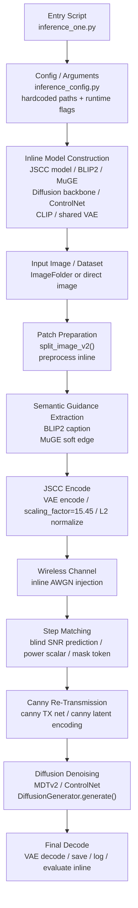
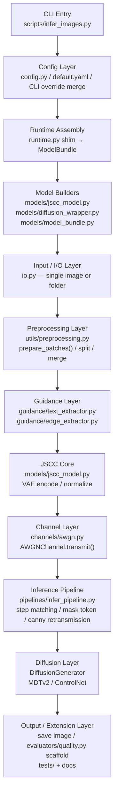

# Framework Comparison

## Purpose

This document compares:

- the original `SGDJSCC/` end-to-end inference framework
- the `sgdjscc_lab/` **Phase 2** modularised framework

The goal is to show how the same AWGN semantic image transmission pipeline was
kept algorithmically similar while being structurally reorganised for research
and extension.

---

## Block Diagram: Original SGDJSCC

---

## Block Diagram: sgdjscc_lab Phase 2

---

## Structural Difference Summary

| Topic | Original `SGDJSCC/` | `sgdjscc_lab` Phase 2 |
|---|---|---|
| Entry point | `inference_one.py` 중심 | `scripts/infer_images.py` |
| Config handling | script 내부 결합 + 일부 하드코딩 | `config.py` + YAML + CLI override |
| Model loading | 한 파일 내부에서 inline 구성 | `models/` + `runtime.py` assembly |
| Channel logic | `_JSCCModel.channel()` 내부 | `channels/awgn.py` |
| Guidance logic | script 내부 함수 | `guidance/` 하위 모듈 |
| Inference flow | script 중심 monolithic | `pipelines/infer_pipeline.py` |
| Preprocessing | script와 util 혼합 | `utils/preprocessing.py` |
| Evaluation | script 끝단에 섞임 | `evaluators/` scaffold 분리 |
| Extensibility | 구조상 확장 어려움 | channel / guidance / evaluator 확장 용이 |
| Original code modification | 해당 없음 | `SGDJSCC/`는 read-only reference 유지 |

---

## Interpretation

### 1. What stayed the same

The following algorithmic blocks are intentionally preserved:

- VAE encode / decode
- scaling factor `15.45`
- AWGN channel corruption
- blind SNR prediction
- step matching
- mask token generation
- canny retransmission
- canny latent conditioning
- diffusion denoising with MDTv2 / ControlNet

In other words, `sgdjscc_lab` Phase 2 is **not a new transmission algorithm**.
It is a **modular re-packaging** of the original `SGDJSCC` inference path.

### 2. What changed structurally

The major Phase 2 change is separation of responsibilities:

- `channels/` isolates wireless corruption logic
- `guidance/` isolates semantic extraction logic
- `models/` isolates construction of core model components
- `pipelines/` isolates the orchestration flow
- `utils/` collects preprocessing, seed, and memory helpers
- `evaluators/` provides a clear insertion point for Phase 3 metrics

### 3. Why this matters

This separation makes later work practical:

- AWGN → Rayleigh channel replacement
- edge guidance → depth / segmentation guidance expansion
- metric loop insertion without touching inference core
- easier testing and clearer failure isolation

---

## Phase 2 Position

Phase 2 should be understood as:

- **algorithm-preserving**
- **structure-improving**
- **research-extension ready**

It is the bridge between:

- **Phase 1**: "make the original AWGN inference reproducible"
- **Phase 3**: "add evaluation, richer guidance, and research features"
