# 프레임워크 비교

## 목적

이 문서는 다음을 비교한다:

- 원본 `SGDJSCC/` end-to-end 추론 프레임워크
- `sgdjscc_lab/` **Phase 2** 모듈화 프레임워크

목표는, 동일한 AWGN 시맨틱 이미지 전송 파이프라인을 알고리즘적으로는 유사하게
유지하면서 연구·확장을 위해 구조적으로 어떻게 재구성했는지 보여주는 것이다.

---

## 나란히 본 블록 다이어그램

```mermaid
flowchart LR
    subgraph ORIG["Original SGDJSCC  (monolithic)"]
        direction TB
        O1["inference_one.py\nEntry Script"]
        O2["inference_config.py\nhardcoded paths + flags"]
        O3["Inline Model Construction\nJSCC / BLIP2 / MuGE\nDiffusion / ControlNet / CLIP"]
        O4["Input Image / Dataset\nImageFolder or direct image"]
        O5["Patch Preparation\nsplit_image_v2() inline"]
        O6["Semantic Guidance\nBLIP2 caption + MuGE soft edge"]
        O7["JSCC Encode\nVAE encode · scale 15.45 · L2 norm"]
        O8["Wireless Channel\ninline AWGN injection"]
        O9["Step Matching\nblind SNR · power scalar · mask token"]
        O10["Canny Re-Transmission\ncanny TX net · canny latent"]
        O11["Diffusion Denoising\nMDTv2 / ControlNet"]
        O12["Final Decode\nVAE decode · save · evaluate inline"]
        O1 --> O2 --> O3 --> O4 --> O5 --> O6
        O6 --> O7 --> O8 --> O9 --> O10 --> O11 --> O12
    end

    subgraph LAB["sgdjscc_lab Phase 2  (modular)"]
        direction TB
        L1["scripts/infer_images.py\nCLI Entry"]
        L2["config.py + default.yaml\nCLI override merge"]
        L3["runtime.py shim\nModelBundle assembly"]
        L4["models/\njscc_model · diffusion_wrapper · model_bundle"]
        L5["io.py\nsingle image or folder"]
        L6["utils/preprocessing.py\nprepare_patches() · split · merge"]
        L7["guidance/\ntext_extractor · edge_extractor"]
        L8["models/jscc_model.py\nVAE encode · normalize"]
        L9["channels/awgn.py\nAWGNChannel.transmit()"]
        L10["pipelines/infer_pipeline.py\nstep matching · mask · canny retransmit"]
        L11["DiffusionGenerator\nMDTv2 / ControlNet"]
        L12["save image\nevaluators/ scaffold · tests/ · docs/"]
        L1 --> L2 --> L3 --> L4 --> L5 --> L6
        L6 --> L7 --> L8 --> L9 --> L10 --> L11 --> L12
    end
```

> **렌더링 안 될 경우:** VS Code에서 `bierner.markdown-mermaid` 확장을 설치하세요.
> GitHub에서는 별도 설치 없이 자동 렌더링됩니다.

---

## 구조적 차이 요약

| 항목 | 원본 `SGDJSCC/` | `sgdjscc_lab` Phase 2 |
|---|---|---|
| 진입점 | `inference_one.py` 중심 | `scripts/infer_images.py` |
| Config 처리 | script 내부 결합 + 일부 하드코딩 | `config.py` + YAML + CLI override |
| 모델 로딩 | 한 파일 내부에서 inline 구성 | `models/` + `runtime.py` assembly |
| 채널 로직 | `_JSCCModel.channel()` 내부 | `channels/awgn.py` |
| 가이드 로직 | script 내부 함수 | `guidance/` 하위 모듈 |
| 추론 흐름 | script 중심 monolithic | `pipelines/infer_pipeline.py` |
| 전처리 | script와 util 혼합 | `utils/preprocessing.py` |
| 평가 | script 끝단에 섞임 | `evaluators/` scaffold 분리 |
| 확장성 | 구조상 확장 어려움 | channel / guidance / evaluator 확장 용이 |
| 원본 코드 수정 | 해당 없음 | `SGDJSCC/`는 read-only reference 유지 |

---

## 해석

### 1. 그대로 유지된 것

다음 알고리즘 블록들은 의도적으로 보존된다:

- VAE encode / decode
- scaling factor `15.45`
- AWGN 채널 손상
- blind SNR 예측
- step matching
- mask token 생성
- canny 재전송
- canny latent 조건화
- MDTv2 / ControlNet 기반 확산 디노이징

다시 말해, `sgdjscc_lab` Phase 2는 **새로운 전송 알고리즘이 아니다**.
원본 `SGDJSCC` 추론 경로를 **모듈식으로 재포장(re-packaging)** 한 것이다.

### 2. 구조적으로 바뀐 것

Phase 2의 주요 변경은 책임의 분리다:

- `channels/`는 무선 손상 로직을 분리한다
- `guidance/`는 시맨틱 추출 로직을 분리한다
- `models/`는 핵심 모델 구성 요소의 생성을 분리한다
- `pipelines/`는 오케스트레이션 흐름을 분리한다
- `utils/`는 전처리·seed·메모리 헬퍼를 모은다
- `evaluators/`는 Phase 3 지표를 위한 명확한 삽입 지점을 제공한다

### 3. 왜 중요한가

이 분리는 이후 작업을 실용적으로 만든다:

- AWGN → Rayleigh 채널 교체
- 엣지 가이드 → depth / segmentation 가이드 확장
- 추론 코어를 건드리지 않고 지표 루프 삽입
- 더 쉬운 테스트와 명확한 실패 격리

---

## Phase 2의 위치

Phase 2는 다음과 같이 이해해야 한다:

- **알고리즘 보존(algorithm-preserving)**
- **구조 개선(structure-improving)**
- **연구 확장 준비 완료(research-extension ready)**

이는 다음 사이의 다리(bridge)다:

- **Phase 1**: "원본 AWGN 추론을 재현 가능하게 만든다"
- **Phase 3**: "평가, 더 풍부한 가이드, 연구 기능을 추가한다"
